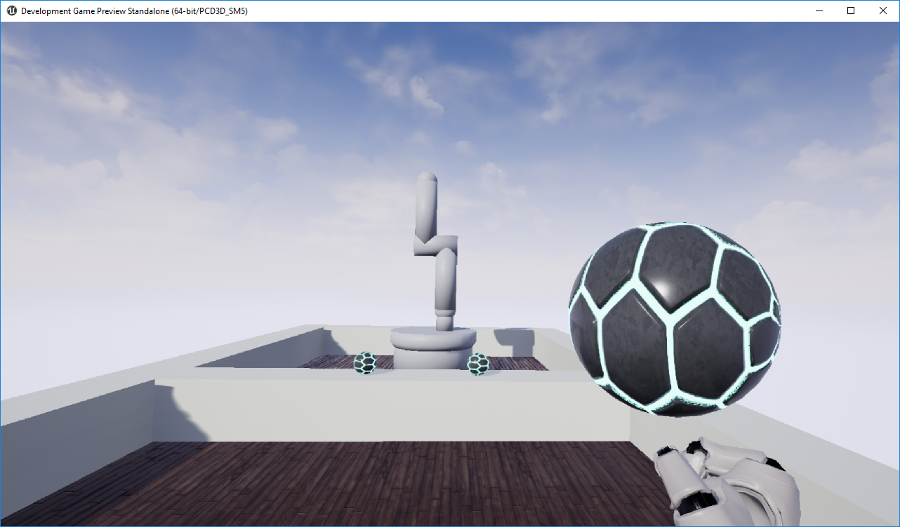
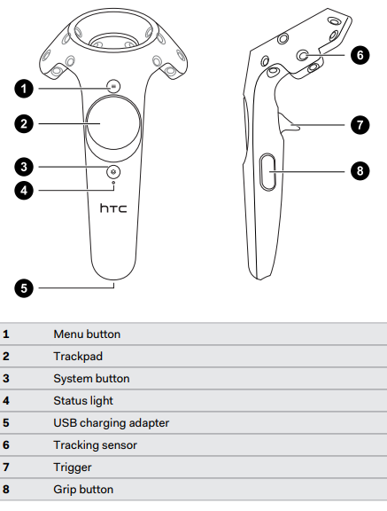

# Ball Throwing with a Virtual Robot
This repository contains the source code for a final year research project allowing a ball throwing game to be played with a virtual robot within Virtual Reality.
The project was developed within the Unreal Engine on version 4.19 for use with the HTC VIVE system.

## Development
This project was developed using a combination of the Blueprints Visual Scripting language for the Virtual Reality interactions, and C++ for the Robot Operating System (ROS) library integration.

The robot model was created as a URDF file called robot.urdf in the ros-ik-integration branch, and an appropriate representation of this model was created within the Unreal Engine.

Currently robot manipulation is implemented using Blueprints to move the robot body, however implementation of the Orocos Kinematics and Dynamics Library (KDL) and its kinematics solvers are being explored for use within the ros-ik-integration branch.
The libraries have been successfully integrated into the Unreal Engine using the Unreal Build Tool, and code can now be developed to make use of an IK solver provided through KDL.

## How to use
- Clone or download the project source
- Configure and start SteamVR
- If using the ros-ik-integration branch, right click the development.uproject file and 'Generate Visaul Studio project files'
- Open the development.uproject file in the Unreal Engine project browser
- Ensure the "World" level is open, and play in the VR Preview

## Controls
Both of the Motion Controllers are programmed to have the same functionality allowing identical behaviour for both left-handed and right-handed users.

- The trackpad can be used to teleport around the room
  - Simply point the motion controller in the direction you wish to move and touch the touchpad to teleport
- The trigger controls can be used to pick up and drop a ball
  - The motion controller will shake when in reach of the ball, at this point hold the trigger to pick up a ball, and release the trigger to throw the ball in the direction of the Motion Controller
  - The ball will travel with the velocity of the Motion Controller on release, so an actual throwing motion is required
